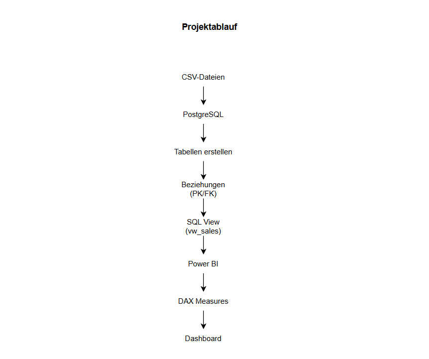
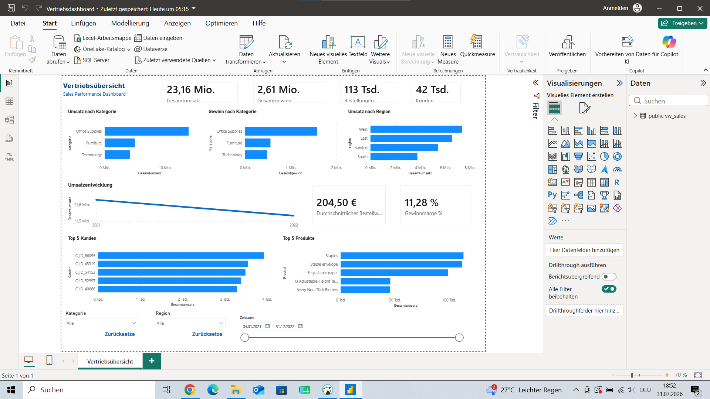
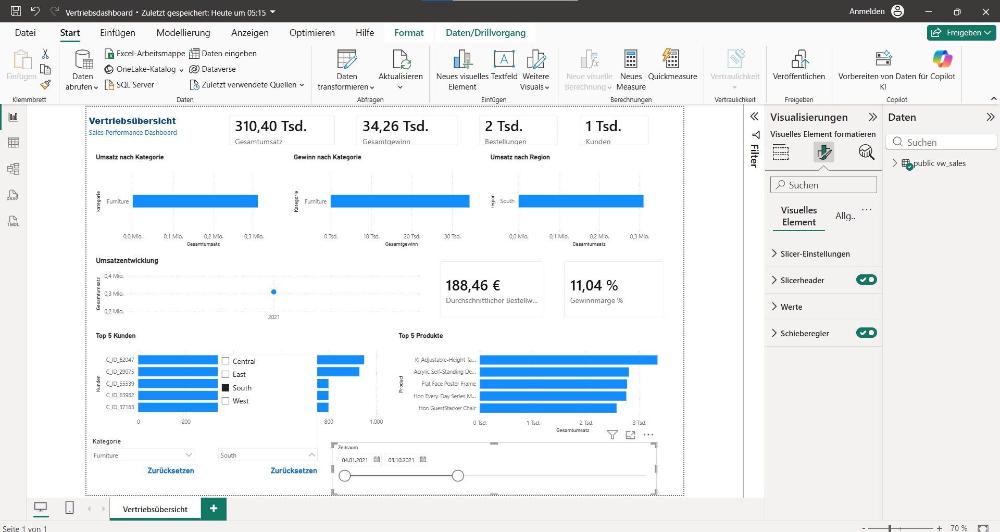

# Sales Dashboard

## Projektziel

Ziel dieses Projekts war es, einen vollständigen Business-Intelligence-Workflow umzusetzen, von den Rohdaten bis zum interaktiven Dashboard.
Der Schwerpunkt lag dabei auf der Datenmodellierung in PostgreSQL, der Datenaufbereitung mit SQL und der Entwicklung eines übersichtlichen Dashboards in Power BI.

## Technischer Ablauf

Die Ausgangsdaten lagen als CSV-Dateien vor.
Diese wurden zunächst in PostgreSQL importiert und in mehrere logisch getrennte Tabellen überführt.
Anschließend wurden die Tabellen über Primär- und Fremdschlüssel miteinander verknüpft.
Zur Vereinfachung der Datenanalyse wurde eine SQL-View (`vw_sales`) erstellt, welche alle für das Dashboard benötigten Informationen zusammenführt.
Diese View wurde anschließend als Datenquelle in Power BI verwendet.

Die wichtigsten SQL-Skripte befinden sich im Ordner **SQL**.

## Datenmodell

Die Datenbank besteht aus mehreren miteinander verbundenen Tabellen:

- customers
- orders
- order_items
- products
- locations

Durch diese Struktur konnten Redundanzen reduziert und die Daten effizient ausgewertet werden.

## Dashboard

Das Dashboard bietet eine interaktive Übersicht über die wichtigsten Vertriebskennzahlen.
Enthalten sind unter anderem:

- Gesamtumsatz
- Gesamtgewinn
- Bestellungen
- Kunden
- Gewinnmarge
- Durchschnittlicher Bestellwert
- Umsatz nach Kategorie
- Umsatz nach Region
- Umsatzentwicklung
- Top 5 Kunden
- Top 5 Produkte

Zusätzlich können alle Auswertungen nach Kategorie, Region und Zeitraum gefiltert werden.

Die Power-BI-Datei befindet sich im Ordner **powerbi**.

## Verwendete Technologien

- PostgreSQL
- SQL
- Power BI
- DAX

## Erkenntnisse aus der Datenanalyse

- Office Supplies erzielte den höchsten Umsatz.
- Die Region West generierte den größten Umsatz.
- Die durchschnittliche Bestellsumme lag bei rund 204 €.
- Die Gewinnmarge betrug ca. 11 %.

## Praktische Erfahrungen

Während dieses Projekts konnte ich praktische Erfahrungen in folgenden Bereichen sammeln:

- Datenmodellierung in PostgreSQL
- Arbeiten mit SQL Views
- Datenaufbereitung mit SQL
- Entwicklung interaktiver Dashboards in Power BI
- Erstellung von DAX Measures
- Visualisierung geschäftsrelevanter Kennzahlen

